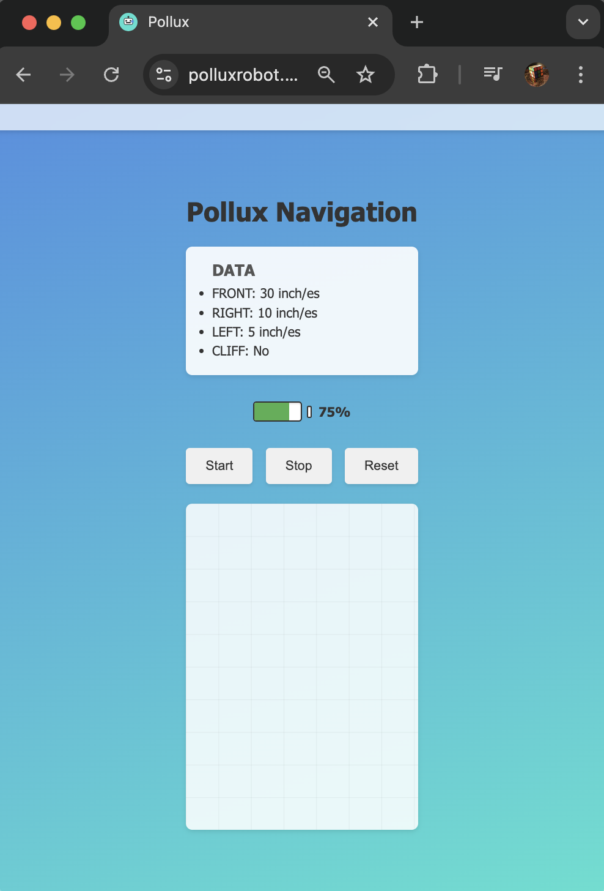

# Pollux Interface

The Pollux Navigation Interface is a React-based web application that allows users to control Pollux and monitor its real-time sensor data.

# Purpose 
This interface provides:

Real-time feedback on Pollux’s environment (sensor readings, obstacle detaction).
Simple navigation controls (Start, Stop, Reset).
An overview of Pollux’s path on a visual grid.

# Next steps 
Integrate Backend Communications

Connect the React front end to the Node.js/Express server (via REST or Socket.IO) for real sensor data and real-time updates.
Live Data & Path Updating

Continuously fetch to sensor readings and navigation updates so the UI reflects Pollux’s movements in real time.

Add more feedback or animations for buttons and sensor readouts.
Possibly include a settings panel for user preferences (speed control, sensor thresholds, etc.).
Testing & Deployment on Raspberry Pi
Unit testing

Test the app locally with actual hardware data.
Deploy the production build and Node.js backend to the Pi for final integration.
Extended Controls & Obstacle Handling

Implement advanced control logic to handle remote/manual tasks.
Integrate obstacle detection and “cliff detection” logic so the UI can warn or automatically stop Pollux.

live at https://polluxrobot.com/

# Photos

